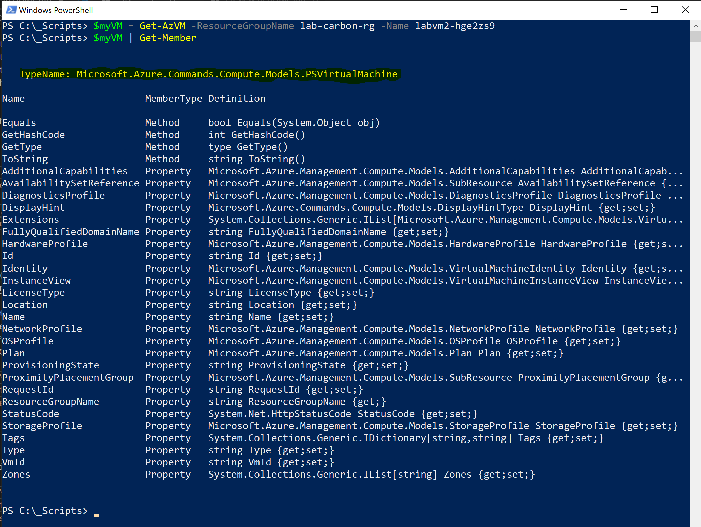
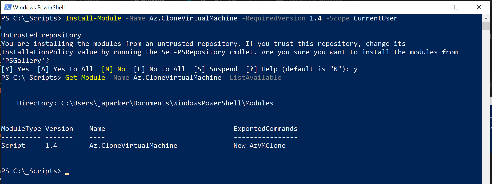
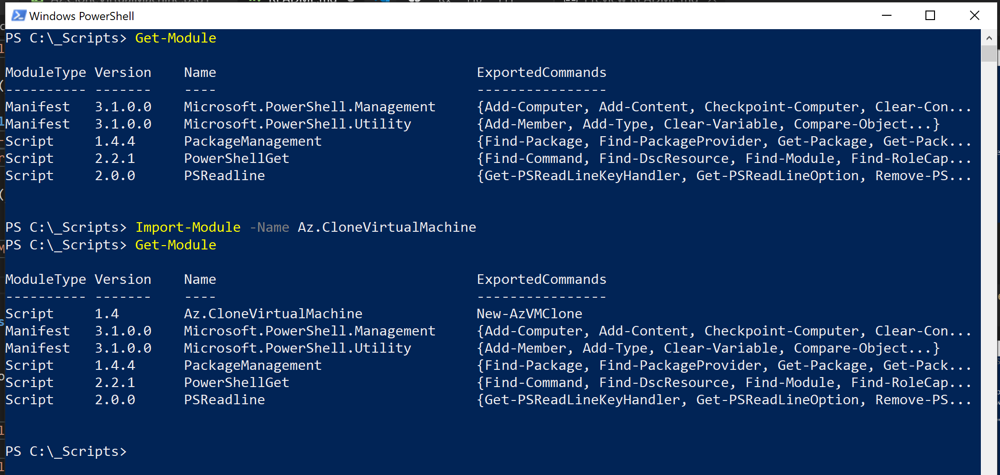
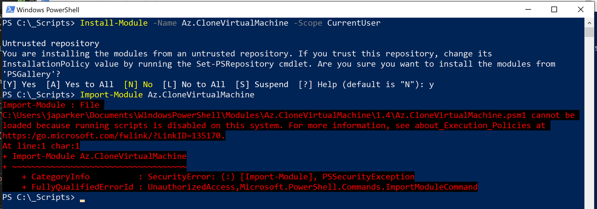
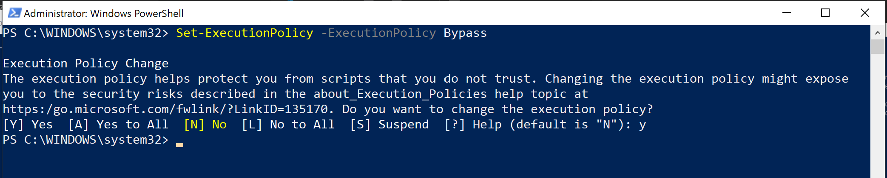
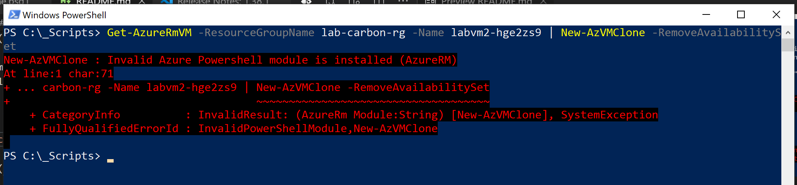
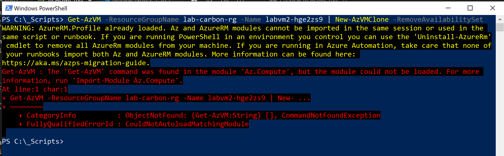

# Clone Azure Virtual Machine (Az.CloneVirtualMachine)

> #### WARNING: 
> This module contains a destructive function, but is safe guarded with continuation prompts allowing the operator to cancel execution.

## Overview
This module will install a function called *New-AzVMClone*.  The function will allow a user migrate to **OR** remove an Azure Virtual Machine from an Availability Set.  This process is most commonly used when Azure Virtual Machines are inadvertently placed into incorrect Availability Sets.  This code was developed to fill a gap because Azure does not provide a way to remove a Virtual Machine from an Availability Set or move a Virtual Machine to a new Availability Set.

## Updates
### v1.5
- Added support for VM Resize during clone operation (new function Select-AzVMSize)
- Added support for VM(s) that are using a Marketplace plan
- Added feature where the VMObject is converted and saved to JSON (in the same working directory) before it is deleted from Azure

---
### Configuration Components
#### CLONED
- VM Name
- VM Size **-or-** VM Re-Size
- OS
- Tags
- OS Disks
- Data Disks (*all*) 
- Network Interfaces (*all*)
- Marketplace Plan
- Boot Diagnostics

#### NOT CLONED
- Extensions (*may be included in a future release*)
---

## Module Function
> ``New-AzVMClone`` : This is the primary function used to migrate **OR** remove a VM from an Availability Set

## Requirements
This function requires PowerShell 5.1 or higher on Windows.

To check your version of PowerShell run:

>``$PSVersionTable.PSVersion``

This function also requires the Azure PowerShell Module and the installation instructions can be found [here](https://docs.microsoft.com/en-us/powershell/azure/install-az-ps?view=azps-2.7.0).

> #### WARNING: 
> You can't have both the AzureRM and Az modules installed for PowerShell 5.1 for Windows at the same time.  The troubleshooting section will outline how to remove the older module.

This Module requires that the correct Virtual Machine object type is passed through the pipeline or from the parameter

- ``Microsoft.Azure.Commands.Compute.Models.PSVirtualMachine``
- ``Microsoft.Azure.Commands.Compute.Models.PSVirtualMachineList``
        
#### Verify ObjectType

## Installation
The preferred method of installation is to *install* the module from the PowerShell Gallery for the active user.

>``Install-Module -Name Az.CloneVirtualMachine -AllowClobber -Scope CurrentUser``

If you want to install the module for all users, this requires administrative privileges.  Be sure to start PowerShell as an Administrator.

>``Install-Module -Name Az.CloneVirtualMachine -AllowClobber -Scope AllUsers``

By default, the PowerShell gallery isn't configured as a trusted repository for PowerShellGet. The first time you use the PSGallery you see the following prompt:

    Untrusted repository
    
    You are installing the modules from an untrusted repository. If you trust this repository, change its InstallationPolicy value by running the Set-PSRepository cmdlet.
    
    Are you sure you want to install the modules from 'PSGallery'?
    [Y] Yes  [A] Yes to All  [N] No  [L] No to All  [S] Suspend  [?] Help (default is "N"):

The ``Install-Module`` command will install the module files on the machine, but the module will need to be imported into your PowerShell session.

>``Import-Module Az.CloneVirtualMachine``

## Module Updates

This module is maintained in the PowerShell Gallery and is updated to fix bugs or introduce new features.  Updating the module is a manual process outlined below:

#### Determine what version is the latest release
>``Find-Module -Name Az.CloneVirtualMachine -AllVersions``

#### Verify what version is currently installed
>``Get-Module -Name Az.CloneVirtualMachine -ListAvailable``

#### Uninstall the module

>*Requires PowerShell Run As Administrator*
>
>``Uninstall-Module -Name Az.CloneVirtualMachine``

#### Install the latest version

Installing the module only makes the module files available to be imported into the PowerShell session.

>``Install-Module -Name Az.CloneVirtualMachine -RequiredVersion 1.4 -Scope CurrentUser``

#### Import the updated module to PowerShell

Using ``Import-Module`` will make the commands available from within the PowerShell session (and future sessions).

>``Import-Module -Name Az.CloneVirtualMachine``

## Troubleshooting

The below items should fix most of the common issues found during installation, updating, or using the module.

#### PowerShell Execution Policy

Depending on your organization, you may have a more restrictive PowerShell Execution Policy.  

It is recommended to set the PowerShell Execution Policy to ByPass temporarialy to be able to install the module.

>*Requires PowerShell Run As Administrator*
>
>``Set-ExecutionPolicy -ExecutionPolicy ByPass``

#### Error: Invalid Azure Powershell module is installed (AzureRM)

If the legacy AzureRM module is still part of your PowerShell session, the function will throw the below error.

The AzureRM module must be uninstalled to prevent conflict

>*Requires PowerShell Run As Administrator*
>
>``Uninstall-AzureRm``

Removing the module rather than **uninstalling** will produce the following **WARNING** and **ERROR**

## Getting Help
The function has comment based help and will provide examples of how to use it.

> ``Get-Help New-AzVMClone -Full``
>
> ``Get-Help New-AzVMClone -Detailed``
>
> ``Get-Help New-AzVMClone -Examples``